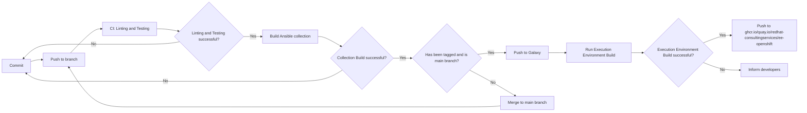

# ansible-collection-openshift

A collection that bundles roles for the management of OpenShift clusters

## Roles

- **add_nodes**: A role to add nodes to an OpenShift cluster
- **bootstrap_cluster**: A role to bootstrap an OpenShift cluster
- **cluster_installation_check**: A role to check the installation status of an OpenShift cluster
- **configure_olm**: A role to configure the operator hub and add custom CatalogSources on a OpenShift cluster
- **bootstrap_gitops**: A role to install and configure OpenShift GitOps on an OpenShift cluster
- **configure_nodes**: A role to label and/or taint nodes in an OpenShift cluster
- **mirror_images**: A role to mirror OpenShift Operators and container images to a private registry

## Execution Environment

This collection includes an Ansible Execution Environment (EE) that packages the collection with all its dependencies and OpenShift CLI tools for easy deployment and usage.

### Container Images

The execution environment images are automatically built and published to:

**GitHub Container Registry**: <https://ghcr.io/redhat-consulting-services/ee-openshift>

### Automatic Builds

When a new release is created, we automatically build both the collection and execution environment container images. These builds are based on the OpenShift versions specified in the `.github/openshift-versions.json` file.

Once the builds are complete, the execution environment container images are tagged and pushed to the GitHub Container Registry (GHCR). The image tags follow the format:

```txt
<release-version>-ocp-<openshift-version>-<build-timestamp>
```

Assuming a release version of `v1.0.0`, OpenShift version `4.19.15`, and a build timestamp of `202407221430`, the resulting image tag would be:

```txt
v1.0.0-ocp-4.19.15-202407221430
```

Right now, we build images for the last three minor OpenShift versions, each with the last five patch versions. For the list of supported OpenShift versions, refer to the `.github/openshift-versions.json` file.

When a new release is created, we also create `latest` tags for the most recent patch version of each minor OpenShift version. Continuing the previous example, if `4.19.15` is the latest patch version for the `4.19` minor version, the following `latest` tag would also be created:

```txt
v1.0.0-ocp-4.19.15-latest
```

### Adding New OpenShift Versions

OpenShift versions are managed via the `scripts/versions-extract.py` script, which extracts the latest versions from `mirror.openshift.com` and updates the `.github/openshift-versions.json` file. The GitHub Actions workflow `.github/workflows/update-version-matrix.yaml` runs this script to keep the version matrix up to date (currently once a week). Manual updates to the JSON are not recommended, as they will be overwritten by the script.

### What's Included

Each execution environment includes:

- **Ansible Collection**: `redhat_consulting_services.openshift`
- **OpenShift CLI Tools**:
  - `oc` - OpenShift command-line interface
  - `openshift-install` - Cluster installation tool
  - `oc-mirror` - Registry mirroring tool
- **Python Dependencies**: All required Python packages
- **Ansible Collections**: `community.general`, `kubernetes.core`

### Manual Build

To build the execution environment locally:

```bash
ansible-builder build --context . -t my-ee:latest --build-arg OPENSHIFT_VERSION=4.19.15
```

### Usage

Instructions on how to use the execution environment and the collection can be found in the [examples/dell_hardware](./examples/dell_hardware/README.md) directory.

## CI Flow


