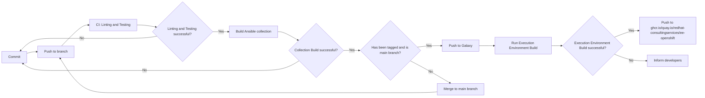

# ansible-collection-openshift

A collection that bundles roles for the management of OpenShift clusters

## Roles

- **bootstrap-cluster**: Bootstrap an OpenShift cluster and generate the necessary manifests and ISOs.
- **node-scaling**: Add additional nodes to an OpenShift cluster.
- **bootstrap-gitops**: Bootstrap an OpenShift cluster with GitOps enabled.

## Execution Environment

This collection includes an Ansible Execution Environment (EE) that packages the collection with all its dependencies and OpenShift CLI tools for easy deployment and usage.

### Container Images

The execution environment images are automatically built and published to:

**GitHub Container Registry**: <https://ghcr.io/redhat-consulting-services/ee-openshift>

### Available Image Tags

Images are built for multiple OpenShift versions with the following tag format:

- **Timestamped tags**: `ghcr.io/redhat-consulting-services/ee-openshift:<repo-tag>-ocp-<openshift-version>-<timestamp>`
- **Latest tags**: `ghcr.io/redhat-consulting-services/ee-openshift:<repo-tag>-ocp-<openshift-version>-latest`

#### Currently Supported OpenShift Versions

- `4.17.36`
- `4.18.20`
- `4.19.5`

#### Example Tags

```text
ghcr.io/redhat-consulting-services/ee-openshift:v1.0.0-ocp-4.18.20-202407221430
ghcr.io/redhat-consulting-services/ee-openshift:v1.0.0-ocp-4.18.20-latest
ghcr.io/redhat-consulting-services/ee-openshift:dev-ocp-4.17.36-latest
```

### Automatic Builds

The execution environment is automatically built using GitHub Actions on:

- Push to `main` or `feat/execution-environment` branches
- Pull requests to `main`
- Manual workflow dispatch

### Adding New OpenShift Versions

To add support for new OpenShift versions, modify the matrix in `.github/workflows/build-ee.yaml`:

```yaml
strategy:
  fail-fast: false
  matrix:
    openshift_version:
      - "4.17.36"
      - "4.18.20"
      - "4.19.5"
      - "4.20.0"  # Add new versions here
```

### What's Included

Each execution environment includes:

- **Ansible Collection**: `redhat_consulting_services.openshift`
- **OpenShift CLI Tools**:
  - `oc` - OpenShift command-line interface
  - `openshift-install` - Cluster installation tool
  - `oc-mirror` - Registry mirroring tool
- **Python Dependencies**: All required Python packages
- **Ansible Collections**: `community.general`, `kubernetes.core`

### Manual Build

To build the execution environment locally:

```bash
ansible-builder build -t my-ee:latest --build-arg OPENSHIFT_VERSION=4.18.20
```

### Usage

Use the execution environment with ansible-runner or in your automation platform:

```bash
podman run -it quay.io/redhatconsultingservices/ee-openshift:dev-ocp-4.18.20-latest ansible-playbook my-playbook.yml
```

## CI Flow


